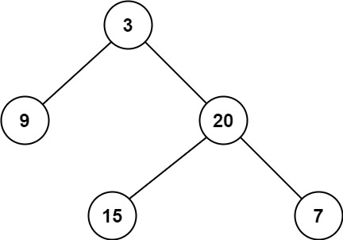

# 0111二叉树的最小深度

## 问题描述

给定一个二叉树，找出其最小深度。

最小深度是从根节点到最近叶子节点的最短路径上的节点数量。

说明：叶子节点是指没有子节点的节点。

示例 1：

输入：root = [3,9,20,null,null,15,7]
输出：2

示例 2：

输入：root = [2,null,3,null,4,null,5,null,6]
输出：5

## 解法

### 层序遍历

相较于深度优先更合理一点。一层一层的依次往下看，只要发现没有孩子的节点，那一定是最小的深度。并不一定将整个树遍历完，可能会提前结束

### 深度优先遍历

需要一个变量表示当前遍历到第几层了，另一个变量记录目前的最小深度。

当到一枝的尽头(没有孩子了)，就往上走。

前中后序都可以：前序的话发现中节点没有孩子了，把空的左右孩子再递归一次也能回来；后序的话，先看孩子，孩子是空马上返回来；中序也差不多。
