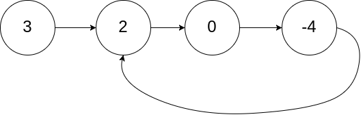
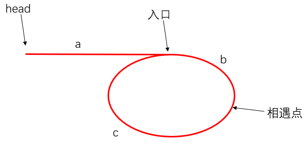

# 0142环形链表II

## 问题描述
给定一个链表的头节点  head ，返回链表开始入环的第一个节点。 如果链表无环，则返回 null。

如果链表中有某个节点，可以通过连续跟踪 next 指针再次到达，则链表中存在环。 为了表示给定链表中的环，评测系统内部使用整数 pos 来表示链表尾连接到链表中的位置（索引从 0 开始）。如果 pos 是 -1，则在该链表中没有环。注意：pos 不作为参数进行传递，仅仅是为了标识链表的实际情况。

不允许修改 链表。

## 解法

主要是一个数学问题。

用双指针法。其中快指针一次走两步，慢指针一次走一步。在环内快指针一定会在某个点与慢指针相遇。
因为虽然fast一次走两步，但是两个指针相对速度就是1，所以一定会相遇的

假设头节点到环入口的距离是a，一圈的长度是b。
并且根据距离与速度的关系，相遇时慢指针在环内走的距离一定不超过一圈。假设快指针与慢指针相遇时，快指针比慢指针多走了n圈，那就有如下关系

$$
f = 2s\\
f = s + nb
$$

显然从刚开始到相遇时慢指针刚好走了n圈的距离，快指针走了2n圈的距离。

还有个现象就是从起点到入口要走的距离一定是 a+tb (t=0,1,2,...)

也就是说相遇时慢指针走了nb的距离，如果再让它走一个a，就一定会到入口。那么怎么判别慢指针又走了a步呢？就需要找一个指针也走a步与它相遇。
那谁走a步能到入口呢？当然是从头节点开始的指针。这里可以新定义一个指针，也可以直接用fast指针，节省一点点空间

写代码的时候也有要注意的点：
> 外层循环判别条件是什么？是快指针会不会到空。
> 
> 为什么外层循环判别条件不是 fast != slow？那由于刚开始两个指针都在head，根本就不会进循环了

