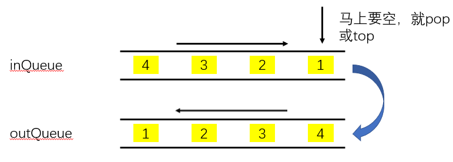
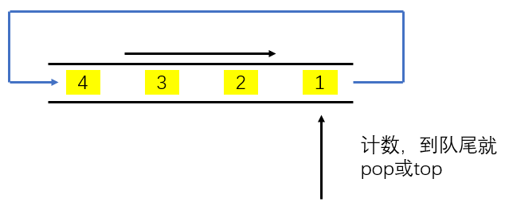

# 0225用队列实现栈

## 问题描述

请你仅使用两个队列实现一个后入先出（LIFO）的栈，并支持普通栈的全部四种操作（push、top、pop 和 empty）。

实现 MyStack 类：

void push(int x) 将元素 x 压入栈顶。
int pop() 移除并返回栈顶元素。
int top() 返回栈顶元素。
boolean empty() 如果栈是空的，返回 true ；否则，返回 false 。

注意：

你只能使用队列的基本操作 —— 也就是 push to back、peek/pop from front、size 和 is empty 这些操作。
你所使用的语言也许不支持队列。 你可以使用 list （列表）或者 deque（双端队列）来模拟一个队列 , 只要是标准的队列操作即可。

## 解法

### 两个队列实现

和栈实现队列类似，一个输入队列存数据，一个输出队列进行pop和top的操作。操作的时候把inQueue队头元素一个一个塞进outQueue，马上要空的时候不留这个元素。

### 一个队列实现

把inQueue元素一个一个塞进outQueue，最后再塞回来，还不如直接就把队头塞进队尾。