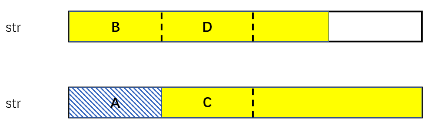

# 0459重复的子字符串

## 问题描述

给定一个非空的字符串 s ，检查是否可以通过由它的一个子串重复多次构成。

 

示例 1:

输入: s = "abab"
输出: true

示例 2:

输入: s = "aba"
输出: false

示例 3:

输入: s = "abcabcabcabc"
输出: true

## 解法

### 移动匹配

观察发现如果一个字符串由某个子串重复组成，那两个字符串拼接后掐头去尾，一定会再次找到这个字符串。

比如 "abcabc"，两个拼接后变成了 "bcabcabcab"，新的字符串一定能在中间找到原字符串 "abcabc"。

时间复杂度表面上是O(n)，其实由于find库函数本身就是O(n)的复杂度，所以总时间复杂度是O(n^2)

### KMP法

KMP法中前缀表本质是最长相同前后缀的长度。如果一个长度m的字符串，前n个(n<m)和后n个相同，那一定是有循环在身上的。

前n个里面，没有跟后n个重复的部分一定是循环部分，图示如下

假设黄色部分就是最长相等的前缀和后缀，上下两个字符串是完全一样的，拆开好看一点。

A段是前缀中，没有与后缀重合的部分。因为上下两段是一样的，所以A段等于B段；而由于前后缀又是一样的，所以B段等于C段；又由于上下两串是一样的，所以D段又等于C段。。。如此往复

而最后的尾巴是否一样就要看最后一次有没有完整的A段，也就是看整个字符串的长度能不能整除A段的长度。