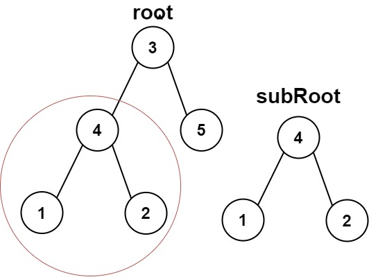
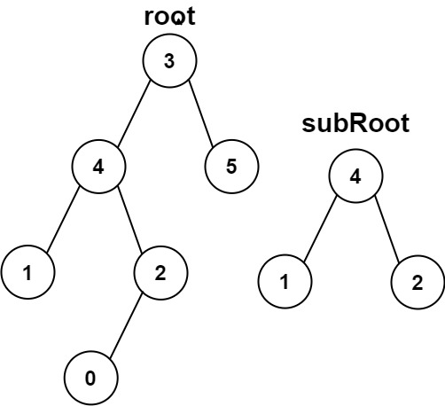

# 0572另一棵树的子节点

## 问题描述

给你两棵二叉树 root 和 subRoot 。检验 root 中是否包含和 subRoot 具有相同结构和节点值的子树。如果存在，返回 true ；否则，返回 false 。

二叉树 tree 的一棵子树包括 tree 的某个节点和这个节点的所有后代节点。tree 也可以看做它自身的一棵子树。

 

示例 1：

输入：root = [3,4,5,1,2], subRoot = [4,1,2]
输出：true

示例 2：

输入：root = [3,4,5,1,2,null,null,null,null,0], subRoot = [4,1,2]
输出：false

## 解法

层序遍历根节点。递归法比较两树是否相等

